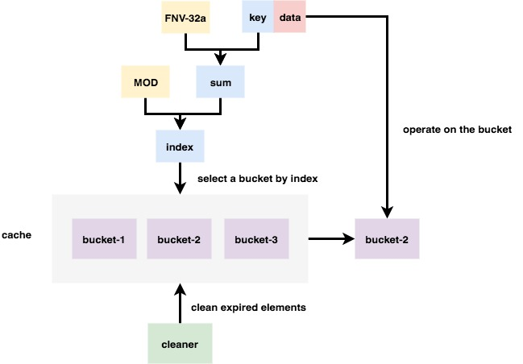

# go-xcache

**go-xcache** package implements an concurrent-safe cache for applications running on a single machine. Now, it only supports the following operations:

- **Set**: add an element to the cache. If the element has existed, replacing it.
- **ESet**: add an element to the cache with a duration, after which the element won't be got.
- **Get**: get an element from the cache. Returns `nil` if this element doesn't exist or has already expired.
- **Del**: delete an element from the cache.

Above opeartions can satisfy my current needs. If they can't solve some problems in the future, I will extend the operation set.

## The basic design

The elements are not stored in a single cache, but distribute in many separated regions, which called **bucket**. 

1. Compute the hash value of the key of an element by using [FNV32-a](https://en.wikipedia.org/wiki/Fowler%E2%80%93Noll%E2%80%93Vo_hash_function) algorithm. 
2. Select the bucket to handle the element by an index, which is equal to *fnv32a sum* `mod` *the number of buckets*.
3. opearte on the bucket.
4. **cleaner** is a goroutine running asynchronously, which will clean expired elements periodically.
