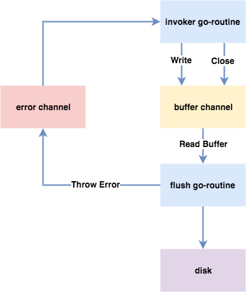

#go-xconnpool


**go-xlog**实现了一个并发环境下使用的滚动日志. 它从以下三个纬度限制  
应用程序在执行过程中日志的产生量:

> * **文件的大小**: 每个日志文件的大小最多只能达到该值. 
> * **文件的后备数量**: 每个应用程序的日志的文件都存放在同一个目录下, 文件的最多只能达到
> 该值, 新的日志文件会把旧的日志文件替换掉.
> * **文件的存储时间**: 每个日志文件的文件名为该日志文件的创建时间, 当日志文件的存储时间
> 超过限制时会被清除.

## 内部结构

**go-xlog**的对用户写xlog和xlog写disk进行了分离, 调用方所处的**main go-routine**  
写入到一个**Buffer Channel**, 再由异步的**flush go-routine**从其中读取数据写入到  
文件缓存, 再由系统写入到持久化设备上.



因为**main go-routine**和**flush go-routine**是异步执行的, 所以**flush go-routine**中  
发生的错误是通过**Channel**的方式通知给**main go-routine**的, 用户在调用**Write()**  
类函数会捕获到该错误.

## 清理策略
**go-xlog**会在打开和创建新的日志文件时执行旧日志文件的清理工作.


## 例子

```go
    
    var (
        err error
        xcfg *xlog.XConfig
        xl   *xlog.XLogger
    )

    xcfg = &xlog.XConfig {
        Dir: "/tmp/log",
        MaxSize: 100 * 1024 * 1024,     // 100 MB
        MaxBackups: 50,
        MaxAge: "168h",                 // 一周
        Tag: "example",
        Level: xlog.INFO,
    }

    if xl, err = xlog.New(xcfg); err != nil {
        // 处理错误.
    }
    // 用完xl应该正常关闭, 才能使残留在内存中的
    // 数据写入到持久化设备上.
    defer xl.Close()

    xl.Fatal("%s", "Fatal Message")
    xl.Error("%s", "Error Message")
    xl.Warn("%s", "Warn Message")
    xl.Info("%s", "Info Message")
    xl.Debug("%s", "Debug Message")

```
