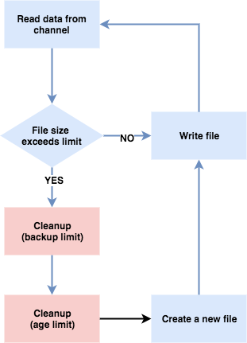

# go-xlog


**go-xlog** implement a concurrently safe rotate-log. It restricts the log volume    
based on the following three dimensions.

  - **Max Size**: The size of each log file reaches this value at most.
  - **Max Backups**: All log files of a logger instance will store in one directory, the number    
  of log files in it reaches this value at most. When reaches this threshold, a new log file   
     will replace an old log file to maintain the total number.
  - **Max Age**: The file name of each log file is its creation time, when the age of a log   
   file exceeds this threshold, it will be deleted.

## Architecture

**go-xlog** separates a user writes to `xlog` and `xlog` writes to the disk,  the invoker of `xlog` writes data to    
the `buffer channel`, then `flush go-routine` flushes these data to the disk asynchronously.


because `invoker go-routine` and `flush go-routine` run independently, so the errors occur in   
`flush go-routine` are transited to `invoker go-routine` through the `channel`,  a user can capture    
these errors when calls `Write` function.


## Cleanup Strategy
**go-xlog** will do cleanup work when open an existing log file or create a new one.




## Usage

```go
    
    var (
        err error
        xcfg *xlog.XConfig
        xl   *xlog.XLogger
    )

    xcfg = &xlog.XConfig {
        Dir: "/tmp/log",
        MaxSize: 100 * 1024 * 1024,     // 100 MB
        MaxBackups: 50,
        MaxAge: "168h",                 // one week
        Tag: "example",
        Level: xlog.INFO,
    }

    if xl, err = xlog.New(xcfg); err != nil {
        // Handle error.
    }
    defer xl.Close()

    xl.Fatal("%s", "Fatal Message")
    xl.Error("%s", "Error Message")
    xl.Warn("%s", "Warn Message")
    xl.Info("%s", "Info Message")
    xl.Debug("%s", "Debug Message")

```
